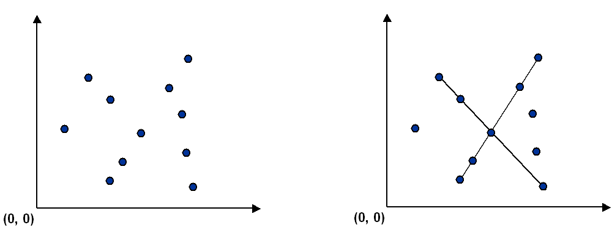

# algorithms

This project, based on [Algorithms course](http://algs4.cs.princeton.edu/home/) from Princeton University,
contains few algorithms and their usage implementation.

All projects require Java 8 and Maven.

Please not that main goal of this projects is efficiency (both time and memory) hence using *Arrays*
instead of *ArrayList* or *byte[]* instead of *Enum* values.

If not stated otherwise in a specific project you may compile each module using:
`mvn compile assembly:single` from specific project directory.
To run each project please use `java -jar target/$PROJECT_JAR`.

Javadoc documentation can be generated using `mvn javadoc:javadoc`.
This will create directory `target/site/apidocs` where `index.html` can be found.

## Algorithms

Currently this project contains following algorithms:

1. [Percolation](#percolation)
2. [Queues](#queues)
3. [Collinear Points](#collinear-points)

### Percolation

Given a composite systems comprised of randomly distributed insulating and metallic materials:
what fraction of the materials need to be metallic so that the composite system is an electrical conductor?
Given a porous landscape with water on the surface (or oil below),
under what conditions will the water be able to drain through to the bottom
(or the oil to gush through to the surface)?
Scientists have defined an abstract process known as [percolation](https://en.wikipedia.org/wiki/Percolation)
to model such situations.

**The model.** We model a percolation system using an *n*-by-*n* grid of sites.
Each site is either open or blocked.
A full site is an open site that can be connected to an open site in the top row
via a chain of neighboring (left, right, up, down) open sites.
We say the system *percolates* if there is a full site in the bottom row.
In other words, a system percolates if we fill all open sites connected to the top row
and that process fills some open site on the bottom row.
(For the insulating/metallic materials example, the open sites correspond to metallic materials,
so that a system that percolates has a metallic path from top to bottom,
with full sites conducting. For the porous substance example,
the open sites correspond to empty space through which water might flow,
so that a system that percolates lets water fill open sites, flowing from top to bottom.)


**The problem.** In a famous scientific problem, researchers are interested in the following question:
if sites are independently set to be open with probability *p* (and therefore blocked with probability *1 − p*),
what is the probability that the system percolates?
When *p* equals *0*, the system does not percolate; when *p* equals *1*, the system percolates.
The plots below show the site vacancy probability *p* versus the percolation probability for
*20*-by-*20* random grid (upper) and *100*-by-*100* random grid (lower).


When *n* is sufficiently large, there is a threshold value _p*_ such that when _p_ < _p*_
a random *n*-by-*n* grid almost never percolates, and when _p_ > _p*_,
a random *n*-by-*n* grid almost always percolates.
No mathematical solution for determining the percolation threshold _p*_ has yet been derived.
This program estimates the threshold value _p*_ using [Monte Carlo simulation](https://en.wikipedia.org/wiki/Monte_Carlo_method).

**Runing the program**

Build the project using
```
$ mvn compile assembly:single
```
then run it like `java -jar $JAR gridSize trialsNumber`.
This is going to compute *trialsNumber* simulations on *gridSize*-by-*gridSize* grid.

Example usage:

```
$ java -jar target/percolation-1.0-SNAPSHOT-jar-with-dependencies.jar 100 2000
mean                    = 0.5930502000000007
stddev                  = 0.015540738954233215
95% confidence interval = [0.5923690970850447, 0.5937313029149568]
```

### Queues

**Dequeue.** A double-ended queue or deque (pronounced "deck") is a generalization of a stack and a queue
that supports adding and removing items from either the front or the back of the data structure.

**Randomized queue.** A randomized queue is similar to a stack or queue, except that the item removed
is chosen uniformly at random from items in the data structure.

**Permutation client.** Client program that takes a command-line integer *k*,
reads in a sequence of strings from standard input and prints exactly *k* of them, uniformly at random.
Assumption is made that *0* ≤ *k* ≤ *n*, where *n* is the number of string on standard input.

Example usage:
```
$ cat examples/distinct.txt 
A B C D E F G H I
$ java -jar target/queues-1.0-SNAPSHOT-jar-with-dependencies.jar 3 < examples/distinct.txt 
H
G
F
```

### Collinear Points

Computer vision involves analyzing patterns in visual images and reconstructing the real-world objects
that produced them. The process is often broken up into two phases:
*feature detection* and *pattern recognition*.
Feature detection involves selecting important features of the image;
pattern recognition involves discovering patterns in the features.
We will investigate a particularly clean pattern recognition problem involving points and line segments.
This kind of pattern recognition arises in many other applications such as statistical data analysis.

**The problem.** Given a set of *n* distinct points in the plane,
find every (maximal) line segment that connects a subset of 4 or more of the points.



**Brute force.** BruteCollinearPoints examines 4 points at a time and checks
whether they all lie on the same line segment, returning all such line segments.
To check whether the 4 points *p*, *q*, *r*, and *s* are collinear,
it checks whether the three slopes between *p* and *q*,
between *p* and *r*, and between *p* and *s* are all equal.

**A faster, sorting-based solution.** Remarkably, it is possible to solve the problem much faster
than the brute-force solution described above.
Given a point *p*, the following method determines whether *p* participates in a set of 4
or more collinear points.

* Think of *p* as the origin.
* For each other point *q*, determine the slope it makes with *p*.
* Sort the points according to the slopes they makes with *p*.
* Check if any 3 (or more) adjacent points in the sorted order have equal slopes with respect to *p*. If so, these points, together with *p*, are collinear.

Applying this method for each of the *n* points in turn yields an efficient algorithm to the problem.
The algorithm solves the problem because points that have equal slopes with respect to *p* are collinear
and sorting brings such points together. The algorithm is fast because the bottleneck operation is sorting.


**Sample client.** The client program takes the name of an input file as a command-line argument,
reads the input file (in the format specified below),
prints to standard output the line segments that your program discovers, one per line
and draws to standard draw the line segments.

Example usage:
```
$ cat src/test/resources/equidistant.txt
15
10000 0
8000 2000
2000 8000
0  10000

20000 0
18000 2000
2000 18000

10000 20000
30000 0
0 30000
20000 10000

13000 0
11000 3000
5000 12000
9000 6000

$ java -jar target/collineearpoints-1.0-SNAPSHOT-jar-with-dependencies.jar src/test/resources/equidistant.txt
(10000, 0) -> (0, 10000)
(10000, 0) -> (30000, 0)
(13000, 0) -> (5000, 12000)
(30000, 0) -> (0, 30000)
```
