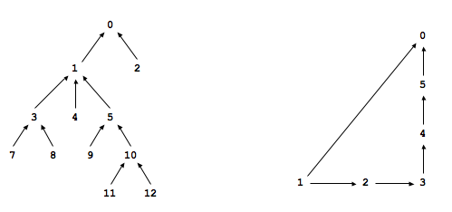

# algorithms

This project, based on [Algorithms course](http://algs4.cs.princeton.edu/home/) from Princeton University,
contains few algorithms and their usage implementation.

All projects require Java 8 and Maven.

Please note that main goal of this projects is efficiency (both time and memory) hence using *Arrays*
instead of *ArrayList* or *byte[]* instead of *Enum* values.

If not stated otherwise in a specific project you may compile each module using:
`mvn compile assembly:single` from specific project directory
or from parent directory to build all projects.
To run each project please use `java -jar $PROJECT_DIR/target/$PROJECT_JAR`.

Javadoc documentation can be generated using `mvn javadoc:aggregate`.
It is also available at [GitHub Pages](https://michalzurawski.github.io/algorithms/apidocs/).

## Algorithms

Currently this project contains following algorithms:

1. [Percolation](#percolation)
2. [Queues](#queues)
3. [Collinear Points](#collinear-points)
4. [8 Puzzle](#8-puzzle)
5. [WordNet](#wordnet)

### Percolation

Given a composite systems comprised of randomly distributed insulating and metallic materials:
what fraction of the materials need to be metallic so that the composite system is an electrical conductor?
Given a porous landscape with water on the surface (or oil below),
under what conditions will the water be able to drain through to the bottom
(or the oil to gush through to the surface)?
Scientists have defined an abstract process known as [percolation](https://en.wikipedia.org/wiki/Percolation)
to model such situations.

**The model.** We model a percolation system using an *n*-by-*n* grid of sites.
Each site is either open or blocked.
A full site is an open site that can be connected to an open site in the top row
via a chain of neighboring (left, right, up, down) open sites.
We say the system *percolates* if there is a full site in the bottom row.
In other words, a system percolates if we fill all open sites connected to the top row
and that process fills some open site on the bottom row.
(For the insulating/metallic materials example, the open sites correspond to metallic materials,
so that a system that percolates has a metallic path from top to bottom,
with full sites conducting. For the porous substance example,
the open sites correspond to empty space through which water might flow,
so that a system that percolates lets water fill open sites, flowing from top to bottom.)


**The problem.** In a famous scientific problem, researchers are interested in the following question:
if sites are independently set to be open with probability *p* (and therefore blocked with probability *1 − p*),
what is the probability that the system percolates?
When *p* equals *0*, the system does not percolate; when *p* equals *1*, the system percolates.
The plots below show the site vacancy probability *p* versus the percolation probability for
*20*-by-*20* random grid (upper) and *100*-by-*100* random grid (lower).


When *n* is sufficiently large, there is a threshold value _p*_ such that when _p_ < _p*_
a random *n*-by-*n* grid almost never percolates, and when _p_ > _p*_,
a random *n*-by-*n* grid almost always percolates.
No mathematical solution for determining the percolation threshold _p*_ has yet been derived.
This program estimates the threshold value _p*_ using [Monte Carlo simulation](https://en.wikipedia.org/wiki/Monte_Carlo_method).

**Runing the program**

Build the project using
```
$ mvn compile assembly:single
```
then run it like `java -jar $JAR gridSize trialsNumber`.
This is going to compute *trialsNumber* simulations on *gridSize*-by-*gridSize* grid.

Example usage:

```
$ java -jar percolation-1.0-jar-with-dependencies.jar 100 2000
mean                    = 0.5930502000000007
stddev                  = 0.015540738954233215
95% confidence interval = [0.5923690970850447, 0.5937313029149568]
```

### Queues

**Dequeue.** A double-ended queue or deque (pronounced "deck") is a generalization of a stack and a queue
that supports adding and removing items from either the front or the back of the data structure.

**Randomized queue.** A randomized queue is similar to a stack or queue, except that the item removed
is chosen uniformly at random from items in the data structure.

**Permutation client.** Client program that takes a command-line integer *k*,
reads in a sequence of strings from standard input and prints exactly *k* of them, uniformly at random.
Assumption is made that *0* ≤ *k* ≤ *n*, where *n* is the number of string on standard input.

Example usage:
```
$ cat examples/distinct.txt 
A B C D E F G H I
$ java -jar queues-1.0-jar-with-dependencies.jar 3 < examples/distinct.txt 
H
G
F
```

### Collinear Points

Computer vision involves analyzing patterns in visual images and reconstructing the real-world objects
that produced them. The process is often broken up into two phases:
*feature detection* and *pattern recognition*.
Feature detection involves selecting important features of the image;
pattern recognition involves discovering patterns in the features.
We will investigate a particularly clean pattern recognition problem involving points and line segments.
This kind of pattern recognition arises in many other applications such as statistical data analysis.

**The problem.** Given a set of *n* distinct points in the plane,
find every (maximal) line segment that connects a subset of 4 or more of the points.


**Brute force.** BruteCollinearPoints examines 4 points at a time and checks
whether they all lie on the same line segment, returning all such line segments.
To check whether the 4 points *p*, *q*, *r*, and *s* are collinear,
it checks whether the three slopes between *p* and *q*,
between *p* and *r*, and between *p* and *s* are all equal.

**A faster, sorting-based solution.** Remarkably, it is possible to solve the problem much faster
than the brute-force solution described above.
Given a point *p*, the following method determines whether *p* participates in a set of 4
or more collinear points.

* Think of *p* as the origin.
* For each other point *q*, determine the slope it makes with *p*.
* Sort the points according to the slopes they makes with *p*.
* Check if any 3 (or more) adjacent points in the sorted order have equal slopes with respect to *p*. If so, these points, together with *p*, are collinear.

Applying this method for each of the *n* points in turn yields an efficient algorithm to the problem.
The algorithm solves the problem because points that have equal slopes with respect to *p* are collinear
and sorting brings such points together. The algorithm is fast because the bottleneck operation is sorting.


**Sample client.** The client program takes the name of an input file as a command-line argument,
reads the input file (in the format specified below),
prints to standard output the line segments that your program discovers, one per line
and draws to standard draw the line segments.

Example usage:
```
$ cat src/test/resources/equidistant.txt
15
10000 0
8000 2000
2000 8000
0  10000

20000 0
18000 2000
2000 18000

10000 20000
30000 0
0 30000
20000 10000

13000 0
11000 3000
5000 12000
9000 6000

$ java -jar collineearpoints-1.0-jar-with-dependencies.jar src/test/resources/equidistant.txt
(10000, 0) -> (0, 10000)
(10000, 0) -> (30000, 0)
(13000, 0) -> (5000, 12000)
(30000, 0) -> (0, 30000)
```

### 8 puzzle

The program to solve the 8-puzzle problem (and its natural generalizations)
using the [A* search algorithm](https://en.wikipedia.org/wiki/A*_search_algorithm).

**The problem.** The [8-puzzle problem](https://en.wikipedia.org/wiki/15_puzzle)
is a puzzle invented and popularized by Noyes Palmer Chapman in the 1870s.
It is played on a 3-by-3 grid with 8 square blocks labeled 1 through 8 and a blank square.
Your goal is to rearrange the blocks so that they are in order, using as few moves as possible.
You are permitted to slide blocks horizontally or vertically into the blank square.
The following shows a sequence of legal moves from an initial board (left) to the goal board (right).

```
    1  3        1     3        1  2  3        1  2  3        1  2  3
 4  2  5   =>   4  2  5   =>   4     5   =>   4  5      =>   4  5  6
 7  8  6        7  8  6        7  8  6        7  8  6        7  8 

 initial        1 left          2 up          5 left          goal
```

**Best-first search.** Now, we describe a solution to the problem that illustrates a general
artificial intelligence methodology known as the A* search algorithm.
We define a search node of the game to be a board, the number of moves made to reach the board,
and the previous search node. First, insert the initial search node
(the initial board, 0 moves, and a null previous search node) into a priority queue.
Then, delete from the priority queue the search node with the minimum priority,
and insert onto the priority queue all neighboring search nodes
(those that can be reached in one move from the dequeued search node).
Repeat this procedure until the search node dequeued corresponds to a goal board.
The success of this approach hinges on the choice of *priority function* for a search node.
We consider two priority functions:

* *Hamming priority function.* The number of blocks in the wrong position, plus the number of moves made
so far to get to the search node. Intuitively, a search node with a small number of blocks in the wrong position
is close to the goal, and we prefer a search node that have been reached using a small number of moves.

* *Manhattan priority function.* The sum of the Manhattan distances (sum of the vertical and horizontal distance)
from the blocks to their goal positions, plus the number of moves made so far to get to the search node.

For example, the Hamming and Manhattan priorities of the initial search node below are 5 and 10, respectively.

```
 8  1  3        1  2  3     1  2  3  4  5  6  7  8    1  2  3  4  5  6  7  8
 4     2        4  5  6     ----------------------    ----------------------
 7  6  5        7  8        1  1  0  0  1  1  0  1    1  2  0  0  2  2  0  3

 initial          goal         Hamming = 5 + 0          Manhattan = 10 + 0
```

We make a key observation: To solve the puzzle from a given search node on the priority queue,
the total number of moves we need to make (including those already made) is at least its priority,
using either the Hamming or Manhattan priority function. (For Hamming priority, this is true
because each block that is out of place must move at least once to reach its goal position.
For Manhattan priority, this is true because each block must move its Manhattan distance from its goal position.
Note that we do not count the blank square when computing the Hamming or Manhattan priorities.)
Consequently, when the goal board is dequeued, we have discovered not only a sequence of moves
from the initial board to the goal board, but one that makes the fewest number of moves.

**A critical optimization.** Best-first search has one annoying feature: search nodes
corresponding to the same board are enqueued on the priority queue many times.
To reduce unnecessary exploration of useless search nodes, when considering the neighbors of a search node,
don't enqueue a neighbor if its board is the same as the board of the previous search node.

```
 8  1  3       8  1  3       8  1       8  1  3     8  1  3
 4     2       4  2          4  2  3    4     2     4  2  5
 7  6  5       7  6  5       7  6  5    7  6  5     7  6

 previous    search node    neighbor   neighbor    neighbor
                                      (disallow)
``` 

**Game tree.** One way to view the computation is as a game tree, where each search node is a node in the game tree
and the children of a node correspond to its neighboring search nodes. The root of the game tree
is the initial search node; the internal nodes have already been processed; the leaf nodes are maintained
in a priority queue; at each step, the A* algorithm removes the node with the smallest priority from the priority queue
and processes it (by adding its children to both the game tree and the priority queue).


**Detecting unsolvable puzzles.** Not all initial boards can lead to the goal board by a sequence of legal moves,
including the two below:

```
 1  2  3         1  2  3  4
 4  5  6         5  6  7  8
 8  7            9 10 11 12
                13 15 14 

 unsolvable     unsolvable
```

To detect such situations, it uses the fact that boards are divided into two equivalence classes
with respect to reachability: (i) those that lead to the goal board
and (ii) those that lead to the goal board if we modify the initial board by swapping any pair of blocks
(the blank square is not a block). To apply the fact, it runs the A* algorithm on *two* puzzle instances—one
with the initial board and one with the initial board modified by swapping a pair of blocks—in lockstep
(alternating back and forth between exploring search nodes in each of the two game trees).
Exactly one of the two will lead to the goal board.

**Solver test client.** Test client read a puzzle from a file (specified as a command-line argument)
and prints the solution to standard output.

**Input and output formats.** The input and output format for a board is the board dimension *n*
followed by the *n*-by-*n* initial board, using 0 to represent the blank square. As an example,

```
% more puzzle04.txt
3
 0  1  3
 4  2  5
 7  8  6

% java -jar puzzle-1.0-jar-with-dependencies.jar puzzle04.txt
Minimum number of moves = 4

3
 0  1  3 
 4  2  5 
 7  8  6 

3
 1  0  3 
 4  2  5 
 7  8  6 

3
 1  2  3 
 4  0  5 
 7  8  6 

3
 1  2  3 
 4  5  0   
 7  8  6 

3
 1  2  3 
 4  5  6 
 7  8  0
% more puzzle3x3-unsolvable.txt
3
 1  2  3
 4  5  6
 8  7  0

% java -jar puzzle-1.0-jar-with-dependencies.jar puzzle3x3-unsolvable.txt
No solution possible
```

The program works correctly for arbitrary n-by-n boards (for any 2 ≤ n < 128),
though it might be too slow to solve some of them in a reasonable amount of time.

### WordNet
[WordNet](http://wordnet.princeton.edu/) is a semantic lexicon for the English language that is used extensively
by computational linguists and cognitive scientists;
for example, it was a key component in IBM's [Watson](https://en.wikipedia.org/wiki/Watson_(computer)).
WordNet groups words into sets of synonyms called *synsets* and describes semantic relationships between them.
One such relationship is the *is-a* relationship, which connects a *hyponym* (more specific synset)
to a *hypernym* (more general synset). For example, *animal* is a hypernym of both *bird* and *fish*;
*bird* is a hypernym of *eagle*, *pigeon*, and *seagull*.

**The WordNet digraph.** Each vertex *v* is an integer that represents a synset, and each directed edge *v*→*w*
represents that *w* is a hypernym of *v*. The wordnet digraph is a rooted DAG (direct acyclic graph):
it is acyclic and has one vertex — the root — that is an ancestor of every other vertex.
However, it is not necessarily a tree because a synset can have more than one hypernym.
A small subgraph of the wordnet digraph is illustrated below.


**The WordNet input file formats.** The files are in CSV format: each line contains a sequence of fields, separated by commas.

* *List of noun synsets*. The file *synsets.txt* lists all the (noun) synsets in WordNet.
The first field is the synset id (an integer), the second field is the synonym set (or synset),
and the third field is its dictionary definition (or gloss). For example, the line
```36,AND_circuit AND_gate,a circuit in a computer that fires only when all of its inputs fire```
means that the synset { AND_circuit, AND_gate } has an id number of 36 and it's gloss is a
*circuit in a computer that fires only when all of its inputs fire*. The individual nouns that comprise a synset
are separated by spaces (and a synset element is not permitted to contain a space).
The *S* synset ids are numbered 0 through *S* − 1; the id numbers will appear consecutively in the synset file.

* *List of hypernyms*. The file *hypernyms.txt* contains the hypernym relationships: The first field is a synset id;
subsequent fields are the id numbers of the synset's hypernyms. For example, the following line
```164,21012,56099```
means that the the synset *164* ("Actifed") has two hypernyms: *21012* ("antihistamine")
and *56099* ("nasal_decongestant"), representing that Actifed is both an antihistamine and a nasal decongestant.
The synsets are obtained from the corresponding lines in the file *synsets.txt*.
```
164,Actifed,trade name for a drug containing an antihistamine and a decongestant...
21012,antihistamine,a medicine used to treat allergies...
56099,nasal_decongestant,a decongestant that provides temporary relief of nasal...
```

**Shortest ancestral path.** An ancestral path between two vertices *v* and *w* in a digraph
is a directed path from *v* to a common ancestor *x*, together with a directed path from *w* to the same ancestor *x*.
A shortest ancestral path is an ancestral path of minimum total length.
For example, in the digraph at left ([digraph1.txt](word-net/digraph1.txt)),
the shortest ancestral path between *3* and *11* has length 4 (with common ancestor *1*).
In the digraph at right ([digraph2.txt](word-net/digraph2.txt)), one ancestral path between *1* and *5* has length 4
(with common ancestor *5*), but the shortest ancestral path has length 2 (with common ancestor *0*).



**Measuring the semantic relatedness of two nouns.** Semantic relatedness refers to the degree to which two concepts are related.
Measuring semantic relatedness is a challenging problem.
For example, most of us agree that George Bush and John Kennedy (two U.S. presidents) are more related
than are George Bush and chimpanzee (two primates).
However, not most of us agree that George Bush and Eric Arthur Blair are related concepts.
But if one is aware that George Bush and Eric Arthur Blair (aka George Orwell) are both communicators,
then it becomes clear that the two concepts might be related.

We define the semantic relatedness of two wordnet nouns *A* and *B* as follows:

* *distance(A, B)* = distance is the minimum length of any ancestral path between any synset *v* of *A* and any synset *w* of *B*.

This is the notion of distance that has been used to implement the `distance()` and `sap()` methods in the WordNet data type.

**Outcast detection.** Given a list of wordnet nouns *A<sub>1</sub>*, *A<sub>2</sub>*, ..., *A<sub>n</sub>*,
which noun is the least related to the others? To identify an outcast, we compute the sum of the distances
between each noun and every other one:

* *d<sub>i</sub>* = dist(*A<sub>i</sub>*, *A<sub>1</sub>*) + dist(*A<sub>i</sub>*, *A<sub>2</sub>*) + ... + dist(*A<sub>i</sub>*, *A<sub>n</sub>*)

and return a noun *A<sub>t</sub>* for which *d<sub>t</sub>* is maximum.
